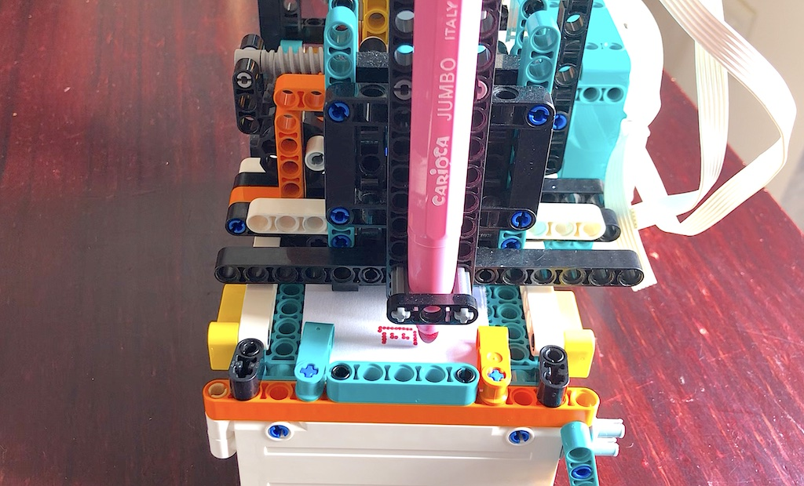
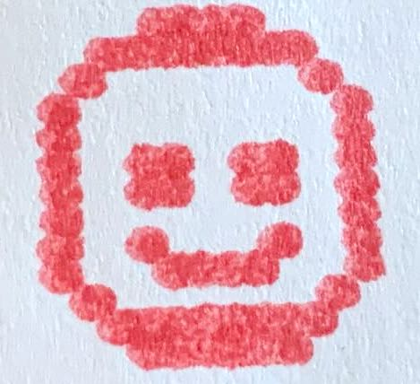
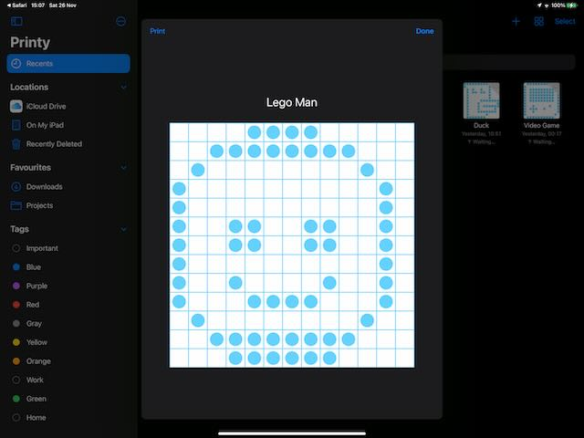
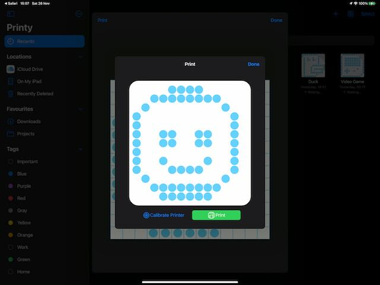
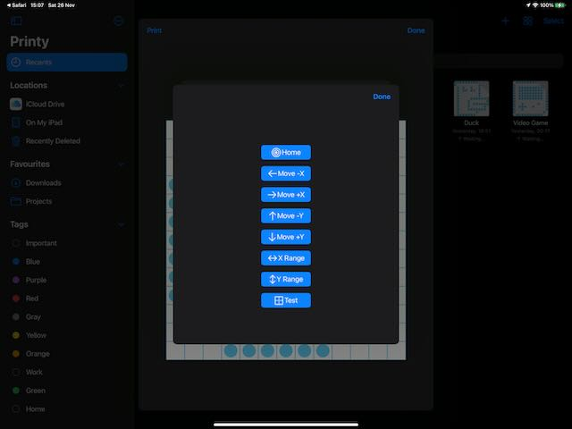

#  Lego Mindstorms Printer

*Luke Van In - November 2022*

## Overview

Demo iPad app used to control a 2D (XY) pen plotter using the Lego Mindstorms 
Robot Inventor or Spike Prime hub. The app is used to create monochrome bitmap 
images which are drawn by the Lego printer.

The app uses my `Swift Mindstorms` SDK for controlling the Lego hub over 
Bluetooth. See the README in that project repository for details on how the 
SDK  works.

This source code is provided as an example of controlling Lego Mindstorms or 
Spike Prime from an iOS application written with the Swift language. The code 
may be used to control your own printer, modified, and shared. 

Here is a timelapse of the printer in action:
[https://youtu.be/JH-cpd-GQnw](https://youtu.be/JH-cpd-GQnw)

Here is a longer video showing some of the details of the printer:
[https://youtu.be/fCvV4ZUtqgc](https://youtu.be/fCvV4ZUtqgc)   

## How to use this app

This app can be used on iPad, to create images which are draw on a printer using 
a Lego Mindstorms Robot Inventor or Lego Spike Prime hub.

### Step 1: Pair your device

Before the Lego hub can be used from the app it needs to be paired with 
your iPad. This only needs to be done once when the hub is first used, and 
sometimes after the firmware on the hub is updated.

1. Open the *Settings* app on the iPad, then tap on *Bluetooth*. 
2. Make sure that Bluetooth is turned on.
3. Turn the hub on and wait for it to start up.
4. Press the Bluetooth button on the hub. The blue light on the hub should start 
flashing and the hub will make an annoying peep-peep noise. Do not be concerned, 
the noise will soon stop while the blue light continues flashing.
4. Wait for the Lego hub to appear on the iPad under *Other devices*, then tap 
on it.
5. The hub will make a bleeping noise and the blue light will stay on. The Lego
hub should appear under *My Devices* as *Connected*. 

If the app cannot connect to the hub then it may be necessary to remove the 
device and repeat the steps. Tap the *i* icon next to the name of the hub, then
tap *Forget Device.* Refer to the documentation from Lego for further 
troubleshooting and assistance.    

### Step 2: Select or Create an image

Launch the app. Select an existing compatible image, or create a new image by 
tapping the "+" button on the navigation bar. 

Here you can see my app with a few images I have created:

### Step 3: Edit the image

Tap on a blank square to draw a dot. Tap again to remove an existing dot.

Here is an image I made:

 
### Step 4: Print the image

Tap on the *Print* button on the navigation bar.

 

Connect to the printer:
1. Turn on the Lego hub, then press the Bluetooth button. The blue light 
should start flashing. 
2. In the app, tap the *Connect to Printer* button.
3. Wait for the hub to appear in the device list, then tap on it.
4. The printer should make a happy bleeping sound when the connection is 
established. 

The app should be able to automatically reconnect to the printer on 
subsequent uses.

Calibrate the printer:
The printer is unable to measure the absolute position of the printer head 
(pen), and assumes the print head is at the starting position when the print is 
started. The print head needs to manually moved to the home position the first 
time the printer is used, or if the printer is disconnected while printing. To 
position the print head:
1. Tap the *Calibrate Printer* button.
2. Hold the *Move (+/-)X/Y* buttons to move the printer head (pen) to the limit 
of it's travel.
3. Tap the *X/Y Range* buttons to check that the print head moves the full range
left-to-right and back-to-front.
4. Tap the *Done* button to dismiss the popup.

Tap the green *Print* button to print the image.

## Background

### Idea

While playing with Lego my 7 year old son asked me to make a mechanical press 
mechanism for a "stamping" machine he was building. One thing led to the next, 
and over the course of a week the stamping machine evolved into a 2D pen plotter 
that works as a rudimentary bitmap dot printer. This is a short story of how the 
printer was developed.

After we assembled the stamper we added motors to automate the stamping 
mechanism. We added a roller to feed in a strip of paper below the stamper so 
that it looked like the machine was stamping onto the paper. While it was fun to 
watch, we decided the stamper would be more interesting if it could actually 
create an impression on paper.

We tried a few different ways of making markings on paper using various bits of 
lego to deform the paper, but there were a few problems. The motor was only 
powerful enough to reliably impress a single dot at a time. We tried using a 
narrower point to poke holes into the paper, although this required a large 
amount of force and quickly destroyed the paper sheet after a few holes were 
punched through it.

### Pen

It became apparant that an ink stamp or pen would be more practical.A few years 
before this I had made a device for son that used a pen to draw patterns on an 
easter egg mounted on a spindle. I borrowed the design for the pen holder I 
created for that project and mounted it on the stamper. This worked well to 
create markings.

After adding the pen, I added an extra motor and a sliding mechanism to move the 
pen on the horizontal axis. The slider used a scotch yoke that was driven by 
a pin on the motor. The roller would feed the paper into the machine, the 
second motor would move the pen from side to side, and the stamper would move the 
pen up and down to draw dots on the paper. 

At this point the device could draw images, albeit at low resolution of 7 x 7 
dots and witha great amount of distortion. The roller that fed the paper would 
often slip, and the sliding mechanism would flex instead of sliding, both of 
which caused uneven gaps between dots. 

### Reliability

I replaced the roller with a more reliable gear and rack linear drive. This had 
a low amount of backlash and provided constant linear motion. I found this 
design to be superior to the scotch yoke. We unfortunately only have one rack
piece, otherwise I would have used gear and rack for all of the axes. This 
design is the earliest one that can be seen in the videos. I did not have the 
foresight to record the earlier designs. I eventually replaced the gear and rack 
with the same scotch yoke used on the horizontal axis for consistency.

This machine was more reliable and could consistently draw somewhat recognisable 
images with less distortion, but it was still not "good enough".

### Rebuild

I rebuilt the machine, changing some of the design to attempt to address some of 
the problems with rigidity and resolution. The three main changes I made were:
 
- Rotated the sliding parts by 90 degrees: The cross section of Lego technic 
beams is slightly taller that it is wide, which means parts have smaller 
clearance (less space) in one axis compared to the other. By positioning the 
sliding rails to take advantage of this I was able to reduce the amount of 
"play" between parts, which resulted in greater accuracy.

- Used worm gears: Worm gears provide a high reduction ration. In my printer 
the reduction is about 22:1, which means the output shaft on the motor needs to 
perform 22 full revolutions for the output gear to perform 1 revolution. This 
gives a high amount of accuracy, as even large motor motions result in very tiny
output motions. Side effects from the motor such as backlash and inertia are
demagnified.

- Mounted the horizontal drive motor on the carriage: In prior designs, the
motor and mechanism used to slide the pen side-to-side was fixed onto the side
of the body of the machine. A pin crank from the motor would push inside a long
slide that moved along with the pen carriage. This design had an unintended side 
effect that the carriage would twist by varying amounts due to slop between 
parts, depending on the position of the pen. This caused a noticable skew in 
the output. In the rebuild, I instead fixed the motor onto the sliding carriage
so that it moves along with the pen. 

This is the current state of the design of the machine. The printer is able to 
consistently output images of 17x17 dots within a space of about 2cm x 2cm. The 
resolution is mostly limited by the resolvable detail allowed by the nib of the 
particular marker we are using. Greater detail should be possible by using a pen
with a finer nib, which I will try out once I am able to get to the shops.

### Printer Resolution

Assuming a gearing ratio of 22:1, and using 180 degrees of travel for each axis,
the printer can in theory address 180 x 22 = 3,960 dots. In reality this is 
lower:

- Some of the available angular resolution is used to compensate for backlash. 
When the motor drives the pen to the starting position, it needs to turn back
by some amount to close the gap between the pin that drives the yoke and the 
edge of the yoke. In my printer this takes a massive 50 degrees, which leaves
only 130 degrees of addressable resolution. Backlash could be greatly reduced by 
using a more direct means to drive the axes, such as by using a gear and rack
mentioned previously, or using a sun and planet gear, or by using a chain and
sprocket. I may have the parts to for the sun and planet gears, although space 
is possibly also a limiting factor in the current design.   

- The motor can't really move exactly by single degree increments. The motor 
takes time to start rotating, and to slow down when stopped, which sometimes 
causes the motor to overshoot or undershoot the intended angle. Precision seems
to decrease as speed increases. Also, the sensor used to measure the motor 
position is slightly "noisy", and reports changing position even when the motor
is stationary. This noise and inconsistency can be filtered out, at the cost
of reducing resolution. My estimate of the practical resolvable resolution of 
the motor is about 5 to 10 degrees.

Considering the above points, a more conservative practical upper limit for 
resolution could be: (130 ÷ 10) x 22 = 13 x 22 = 286 dots. Not terrible. 

### Linear motion

My printer currently uses a pin that rotates around the output shaft of the 
motor to drive the scotch yoke. This translates rotary motion from the motor 
into linear motion to slide the pen from front-to-back and side-to-side. The 
geometry causes the pen motion to follow a sinusoidal curve, so that dots near
the limits of the image are more closely spaced than dots near the center. The
app needs to compensate for this. It is relatively easy for the program to to 
compensate for this using a bit of geometry to compute how far the motor needs 
to turn in order to move the pen with consistent linear motion.  

### Manual Positioning

[TODO] 
